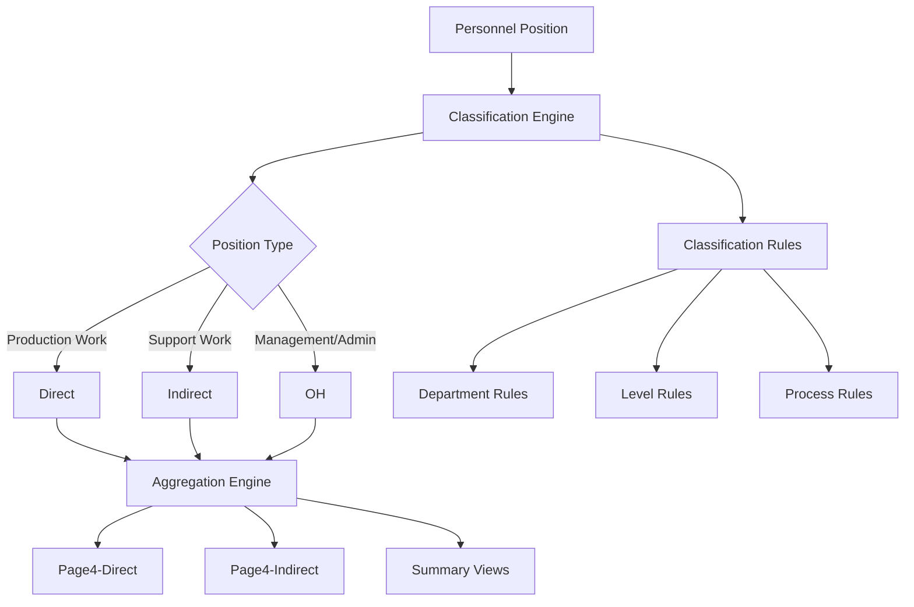
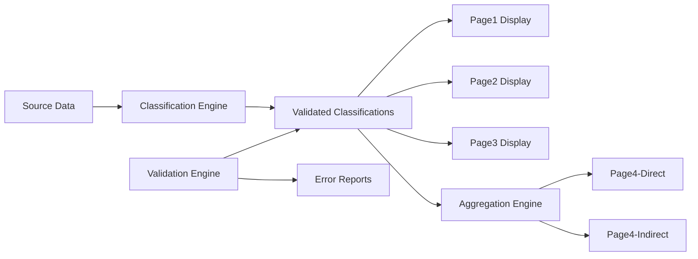

# Design Document

## Overview

This design addresses data consistency issues in the organization chart application by establishing a centralized classification system and implementing validation mechanisms. The solution ensures that personnel classifications (Direct, Indirect, OH) are consistent across all pages and that aggregation logic accurately reflects the detailed views.

## Architecture

### Classification System Architecture



### Data Flow Architecture



## Components and Interfaces

### 1. Classification Engine

**Purpose**: Centralized logic for determining personnel classifications

**Interface**:
```typescript
interface ClassificationEngine {
  classifyPosition(
    department: string,
    level: 'PM' | 'LM' | 'GL' | 'TL' | 'TM' | 'DEPT',
    processType?: string,
    subtitle?: string
  ): 'direct' | 'indirect' | 'OH';
  
  getClassificationRules(): ClassificationRules;
  validateClassification(position: Position): ValidationResult;
}

interface ClassificationRules {
  departmentRules: Record<string, ClassificationRule>;
  levelRules: Record<string, ClassificationRule>;
  processRules: Record<string, ClassificationRule>;
  exceptionRules: ExceptionRule[];
}

interface ClassificationRule {
  defaultClassification: 'direct' | 'indirect' | 'OH';
  conditions?: ClassificationCondition[];
}

interface ExceptionRule {
  condition: (position: Position) => boolean;
  classification: 'direct' | 'indirect' | 'OH';
  reason: string;
}
```

### 2. Validation Engine

**Purpose**: Detect and report classification inconsistencies

**Interface**:
```typescript
interface ValidationEngine {
  validateConsistency(): ValidationReport;
  validateAggregation(): AggregationValidationReport;
  validatePosition(position: Position): PositionValidationResult;
}

interface ValidationReport {
  isValid: boolean;
  inconsistencies: Inconsistency[];
  summary: ValidationSummary;
}

interface Inconsistency {
  positionId: string;
  department: string;
  level: string;
  expectedClassification: string;
  actualClassification: string;
  pages: string[];
  reason: string;
}
```

### 3. Aggregation Engine

**Purpose**: Generate consistent aggregation data for summary pages

**Interface**:
```typescript
interface AggregationEngine {
  generateDirectSummary(): DirectSummaryData;
  generateIndirectSummary(): IndirectSummaryData;
  generateOHSummary(): OHSummaryData;
  validateAggregationTotals(): boolean;
}

interface SummaryData {
  [level: string]: {
    [department: string]: number;
    SUM: number;
  };
}
```

## Data Models

### Position Classification Model

```typescript
interface Position {
  id: string;
  department: string;
  level: 'PM' | 'LM' | 'GL' | 'TL' | 'TM' | 'DEPT';
  title: string;
  subtitle?: string;
  processType?: string;
  lineIndex?: number;
  classification: 'direct' | 'indirect' | 'OH';
  source: 'page1' | 'page2' | 'page3' | 'separated';
  metadata: {
    manpower?: number;
    responsibilities?: string[];
    processName?: string;
  };
}
```

### Classification Rules Model

```typescript
interface ClassificationRuleSet {
  // Department-based rules
  departmentClassifications: {
    'Line': 'indirect'; // PM/LM = OH, all others = indirect
    'Quality': 'indirect' | 'OH'; // GL=OH, others=indirect
    'CE': 'direct' | 'OH'; // TM(Mixing)=direct, others=OH
    'Admin': 'OH';
    'Small Tooling': 'OH';
    'Raw Material': 'indirect';
    'Sub Material': 'OH';
    'ACC Market': 'indirect';
    'P&L Market': 'indirect';
    'Bottom Market': 'indirect';
    'Plant Production': 'direct' | 'indirect'; // TM=direct, others=indirect
    'FG WH': 'indirect' | 'OH'; // TM(Shipping)=OH, others=indirect
    'TPM': 'OH';
    'CQM': 'OH';
    'Lean': 'OH';
    'Security': 'OH';
    'RMCC': 'OH';
  };
  
  // Level-based overrides
  levelOverrides: {
    'PM': 'OH';
    'LM': 'OH';
  };
  
  // Specific exceptions
  exceptions: ExceptionRule[];
}
```

## Error Handling

### Classification Errors

1. **Unknown Department**: Default to 'indirect' with warning log
2. **Missing Classification Rule**: Use level-based fallback
3. **Conflicting Rules**: Apply most specific rule with precedence order

### Validation Errors

1. **Inconsistent Classifications**: Log detailed report with position details
2. **Aggregation Mismatches**: Highlight specific discrepancies
3. **Missing Data**: Report incomplete position information

### Recovery Strategies

1. **Graceful Degradation**: Continue operation with warnings
2. **Auto-correction**: Apply most likely classification based on similar positions
3. **User Notification**: Display validation status in UI

## Testing Strategy

### Unit Testing

1. **Classification Engine Tests**
   - Test each department classification rule
   - Test level-based overrides
   - Test exception handling
   - Test edge cases (missing data, unknown departments)

2. **Validation Engine Tests**
   - Test consistency detection
   - Test aggregation validation
   - Test error reporting format
   - Test performance with large datasets

3. **Aggregation Engine Tests**
   - Test summary generation accuracy
   - Test total calculations
   - Test department grouping
   - Test cross-page consistency

### Integration Testing

1. **End-to-End Classification Flow**
   - Generate positions from all pages
   - Apply classifications
   - Validate consistency
   - Generate aggregations
   - Verify totals match

2. **Cross-Page Consistency Tests**
   - Compare same positions across different pages
   - Verify aggregation pages match detailed views
   - Test with different configuration scenarios

### Validation Testing

1. **Data Integrity Tests**
   - Verify no positions are double-counted
   - Verify no positions are missing from aggregations
   - Test with various line counts and model selections

2. **Performance Tests**
   - Test classification speed with maximum configurations
   - Test validation performance
   - Test memory usage with large datasets

## Implementation Phases

### Phase 1: Classification Engine
- Implement centralized classification logic
- Define classification rules for all departments
- Create position classification interface

### Phase 2: Validation Engine  
- Implement consistency checking
- Create validation reporting
- Add error detection and logging

### Phase 3: Integration and Testing
- Integrate classification engine with existing pages
- Update aggregation logic to use validated classifications
- Implement comprehensive test suite

### Phase 4: UI Updates and Monitoring
- Add validation status indicators to UI
- Implement real-time consistency checking
- Create admin dashboard for monitoring classification health